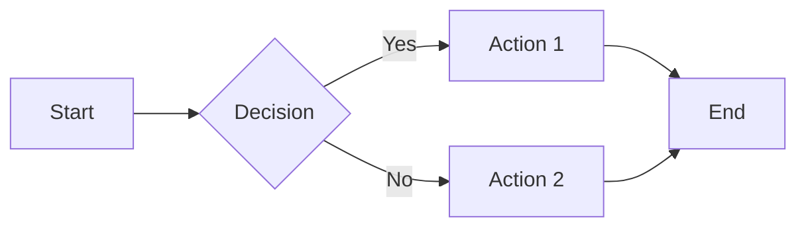

# Drauu Drawing Tools Test

## Interactive Drawing Canvas

<script setup>
import { useDrauu } from 'drauu'

// Initialize Drauu with custom configuration
const drauu = useDrauu({
  brush: {
    size: 4,
    color: '#3b82f6'
  }
})

function clearCanvas() {
  drauu.clear()
}

function setBrushSize(size) {
  drauu.brush.size = size
}

function setBrushColor(color) {
  drauu.brush.color = color
}
</script>

### Canvas Drawing Area

<div class="drawing-demo">
  <div class="controls">
    <h3>Drawing Controls:</h3>
    <div class="control-group">
      <label>Brush Size:</label>
      <button @click="setBrushSize(2)">Small (2px)</button>
      <button @click="setBrushSize(4)">Medium (4px)</button>
      <button @click="setBrushSize(8)">Large (8px)</button>
    </div>
    
    <div class="control-group">
      <label>Brush Color:</label>
      <button @click="setBrushColor('#3b82f6')">Blue</button>
      <button @click="setBrushColor('#ef4444')">Red</button>
      <button @click="setBrushColor('#22c55e')">Green</button>
      <button @click="setBrushColor('#f59e0b')">Orange</button>
    </div>
    
    <div class="control-group">
      <button @click="clearCanvas" class="clear-btn">Clear Canvas</button>
    </div>
  </div>
  
  <div class="canvas-container">
    <svg ref="svg" class="drawing-canvas" viewBox="0 0 800 400">
      <!-- Drawing will happen here -->
    </svg>
  </div>
</div>

<style>
.drawing-demo {
  max-width: 900px;
  margin: 20px auto;
  padding: 20px;
  border: 1px solid #ddd;
  border-radius: 8px;
}

.controls {
  margin-bottom: 20px;
  padding: 15px;
  background: #f8f9fa;
  border-radius: 6px;
}

.control-group {
  margin: 10px 0;
}

.control-group label {
  display: inline-block;
  width: 80px;
  font-weight: bold;
}

.control-group button {
  margin: 2px;
  padding: 6px 12px;
  border: 1px solid #ccc;
  border-radius: 4px;
  background: white;
  cursor: pointer;
}

.control-group button:hover {
  background: #e9ecef;
}

.clear-btn {
  background: #fee2e2 !important;
  border-color: #fecaca !important;
  color: #dc2626 !important;
}

.clear-btn:hover {
  background: #fecaca !important;
}

.canvas-container {
  border: 2px dashed #ccc;
  border-radius: 6px;
  overflow: hidden;
}

.drawing-canvas {
  width: 100%;
  height: 400px;
  background: white;
  cursor: crosshair;
}

.drawing-canvas path {
  stroke-linecap: round;
  stroke-linejoin: round;
}
</style>

---

# Drawing Tools Overview

## Available Tools

### 🖌️ Brush Tool
- **Freehand drawing** on slides
- **Customizable size** (2px - 20px)
- **Color selection** (any hex color)
- **Smooth strokes** with anti-aliasing

### ➡️ Arrow Tool
- **Directional arrows** for flow diagrams
- **Curved arrows** support
- **Custom styling** options

### 🔲 Shape Tools
- **Rectangles** and **squares**
- **Circles** and **ellipses**
- **Lines** and **polylines**
- **Freeform shapes**

### 📝 Text Annotations
- **Add text** directly to slides
- **Custom fonts** and **sizes**
- **Positioning** and **alignment**

### 🧽 Eraser Tool
- **Remove strokes** selectively
- **Full canvas clear** option
- **Undo/redo** functionality

---

# Configuration Examples

## Basic Configuration

```typescript
// slidev.config.ts
import { defineConfig } from '@slidev/types'

export default defineConfig({
  drauu: {
    brush: {
      size: 4,
      color: '#3b82f6'
    },
    classes: {
      drawing: 'my-drawing-canvas',
      svg: 'my-drawing-svg'
    }
  }
})
```

## Advanced Configuration

```typescript
// Advanced Drauu setup
import { defineConfig } from '@slidev/types'

export default defineConfig({
  drauu: {
    brush: {
      size: 6,
      color: '#22c55e',
      opacity: 0.8
    },
    shapes: {
      strokeWidth: 2,
      fillOpacity: 0.1
    },
    svg: {
      width: '100%',
      height: '400px'
    },
    classes: {
      drawing: 'interactive-drawing',
      svg: 'drawing-layer'
    }
  }
})
```

---

# Usage in Vue Components

## Setup Drauu in Vue

```vue
<script setup>
import { ref, onMounted } from 'vue'
import { useDrauu } from 'drauu'

const svgRef = ref(null)
const drawingData = ref('')

// Initialize Drauu
const drauu = useDrauu(svgRef, {
  brush: {
    size: 4,
    color: '#3b82f6'
  }
})

// Save drawing
function saveDrawing() {
  drawingData.value = drauu.dump()
}

// Load drawing
function loadDrawing() {
  if (drawingData.value) {
    drauu.load(drawingData.value)
  }
}

// Clear canvas
function clearCanvas() {
  drauu.clear()
}

onMounted(() => {
  // Drauu is ready for drawing
})
</script>

<template>
  <div>
    <div class="controls">
      <button @click="saveDrawing">Save</button>
      <button @click="loadDrawing">Load</button>
      <button @click="clearCanvas">Clear</button>
    </div>
    
    <svg ref="svgRef" class="drawing-canvas"></svg>
    
    <div v-if="drawingData">
      <h4>Saved Drawing Data:</h4>
      <textarea v-model="drawingData" rows="4"></textarea>
    </div>
  </div>
</template>
```

---

# Integration with Slidev

## Automatic Canvas Creation

Drauu automatically creates drawing canvases in your slides:

```markdown
# My Presentation

## Slide with Drawing

<div class="drawing-canvas">
  <!-- Drauu automatically creates SVG here -->
</div>

## Slide with Custom Canvas

<div class="my-custom-canvas">
  <!-- Custom drawing area -->
</div>
```

## CSS Styling

```css
/* Custom drawing canvas styles */
.drawing-canvas {
  border: 2px solid #3b82f6;
  border-radius: 8px;
  background: #f8fafc;
}

.drawing-canvas path {
  stroke-width: 2px;
  stroke-linecap: round;
  stroke-linejoin: round;
}
```

---

# Troubleshooting

## Common Issues

### Canvas Not Responsive
```typescript
// Ensure SVG has proper viewBox
<svg class="drawing-canvas" viewBox="0 0 800 400">
```

### Drawing Not Saving
```typescript
// Check if Drauu is properly initialized
const drauu = useDrauu(svgRef)
console.log('Drauu initialized:', !!drauu)
```

### Performance Issues
```typescript
// Optimize for large drawings
const drauu = useDrauu(svgRef, {
  maxPoints: 1000, // Limit points for performance
  throttle: 16 // Throttle drawing events
})
```

## Browser Compatibility

- ✅ **Chrome** 80+
- ✅ **Firefox** 75+
- ✅ **Safari** 13+
- ✅ **Edge** 80+

## Mobile Support

- ✅ **Touch drawing** support
- ✅ **Responsive canvas** sizing
- ✅ **Gesture recognition**

---

# Examples Gallery

## Flow Diagrams

Use Drauu to create interactive flow diagrams:



## Architecture Diagrams

Draw system architecture directly on slides:

```
[Frontend] --> [API Gateway]
[API Gateway] --> [Microservice A]
[API Gateway] --> [Microservice B]
[Database] --> [Microservice A]
[Database] --> [Microservice B]
```

## Mind Maps

Create interactive mind maps:

```
Central Topic
├── Branch 1
│   ├── Sub-branch 1.1
│   └── Sub-branch 1.2
├── Branch 2
│   └── Sub-branch 2.1
└── Branch 3
```

---

# Best Practices

## Drawing Performance

1. **Limit canvas size** for better performance
2. **Use appropriate brush sizes** for your content
3. **Clear unused drawings** regularly
4. **Optimize for mobile** devices

## User Experience

1. **Provide clear controls** for drawing tools
2. **Include undo/redo** functionality
3. **Save drawings** automatically
4. **Use appropriate colors** for contrast

## Integration Tips

1. **Combine with other modules** (Monaco, Shiki)
2. **Use consistent styling** across slides
3. **Export drawings** as images when needed
4. **Test on different devices** and browsers

---

*Drauu makes drawing and annotation in presentations intuitive and powerful!*