# Mermaid Diagrams Test

## Create Beautiful Diagrams with Code

### What is Mermaid?

Mermaid lets you create diagrams and visualizations using **text-based syntax**. It's perfect for:
- 📊 **Documentation**
- 🎨 **Presentations** 
- 📝 **Technical writing**
- 🔄 **Process flows**
- 💻 **System architecture**

---

## Flowcharts

### Basic Flowchart

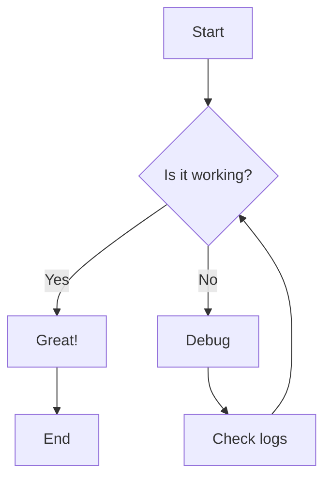

### Complex Flowchart with Subgraphs

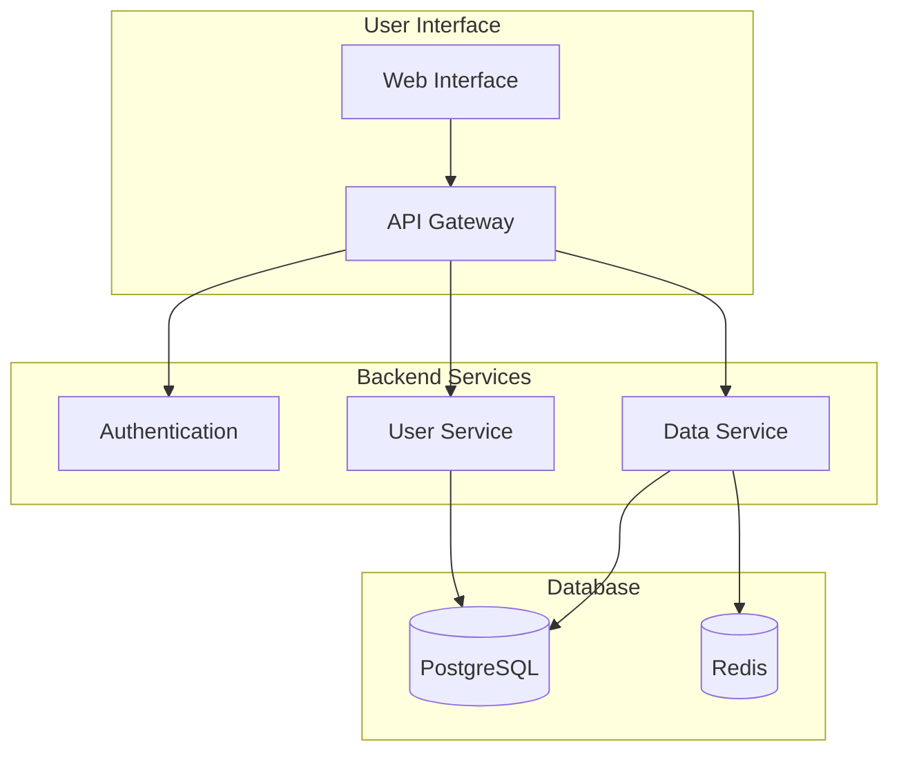

---

## Sequence Diagrams

### Simple Communication

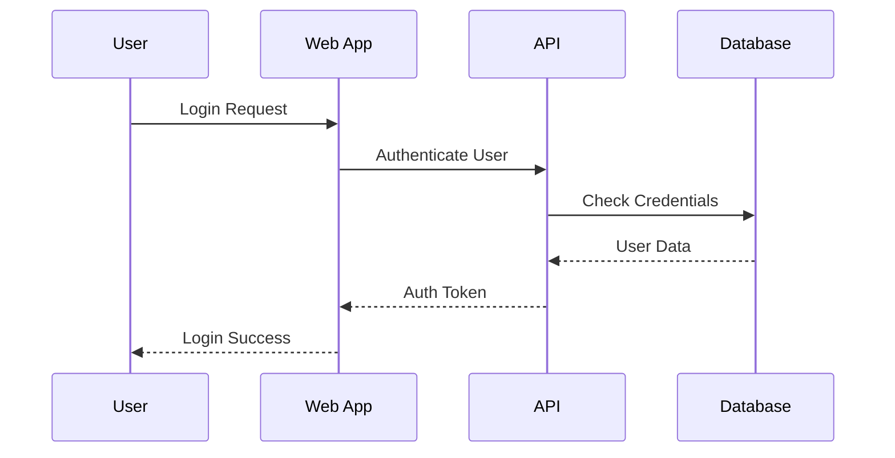

### Complex Interaction

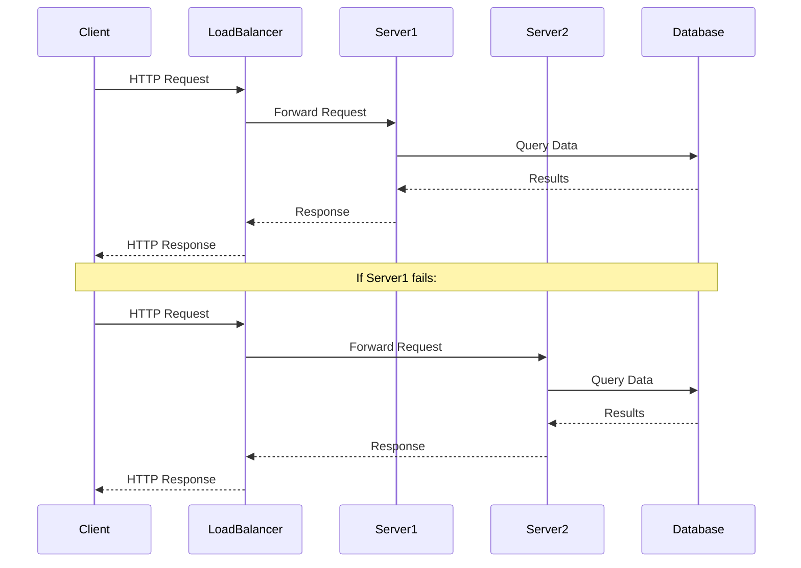

---

## Class Diagrams

### Software Architecture

```mermaid
classDiagram
    class User {
        +String id
        +String email
        +String name
        +Date createdAt
        +login()
        +logout()
        +updateProfile()
    }
    
    class Course {
        +String id
        +String title
        +String description
        +Date startDate
        +addStudent()
        +removeStudent()
        +getStudents()
    }
    
    class Lecture {
        +String id
        +String title
        +String content
        +int order
        +publish()
        +unpublish()
    }
    
    class Enrollment {
        +String id
        +Date enrolledAt
        +String status
        +complete()
        +drop()
    }
    
    User ||--o{ Enrollment : has
    Course ||--o{ Enrollment : has
    Course ||--o{ Lecture : contains
    User ||--o{ Course : creates
```

### Database Schema

```mermaid
classDiagram
    class User {
        +UUID id PK
        +String email UK
        +String password_hash
        +String first_name
        +String last_name
        +Timestamp created_at
        +Timestamp updated_at
    }
    
    class Post {
        +UUID id PK
        +UUID user_id FK
        +String title
        +Text content
        +Timestamp created_at
        +Timestamp updated_at
    }
    
    class Comment {
        +UUID id PK
        +UUID post_id FK
        +UUID user_id FK
        +Text content
        +Timestamp created_at
    }
    
    class Tag {
        +UUID id PK
        +String name UK
        +String description
    }
    
    class PostTag {
        +UUID post_id FK
        +UUID tag_id FK
    }
    
    User ||--o{ Post : writes
    User ||--o{ Comment : makes
    Post ||--o{ Comment : has
    Post ||--o{ PostTag : has
    Tag ||--o{ PostTag : used_in
```

---

## State Diagrams

### User Authentication Flow

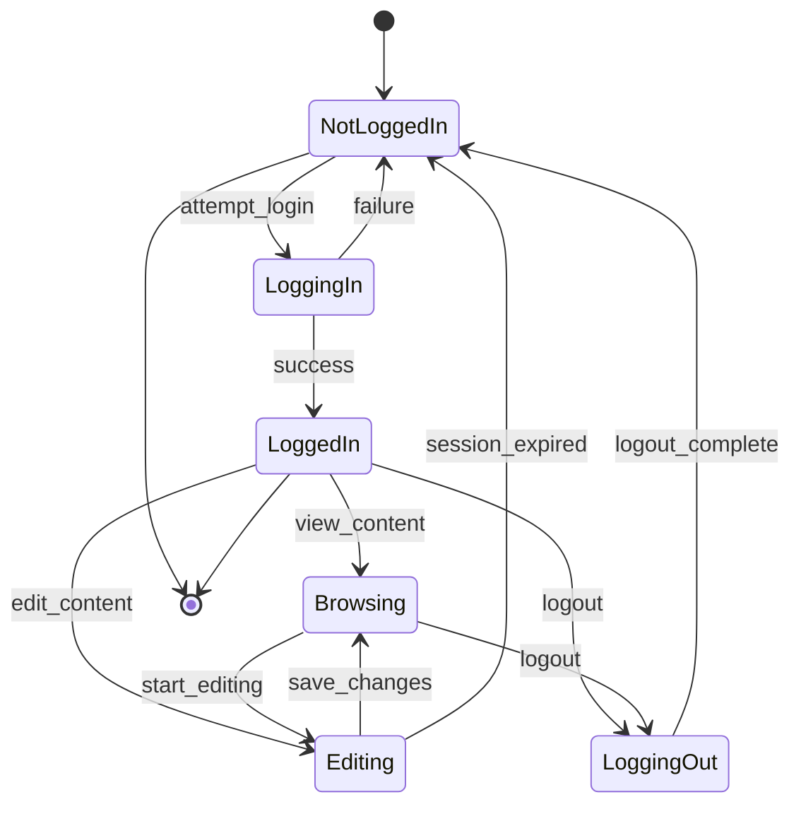

### Order Processing System

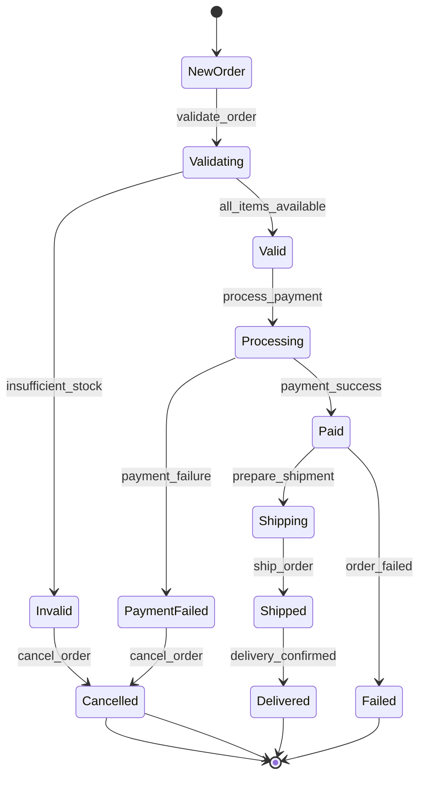

---

## Entity-Relationship Diagrams

### E-commerce Database

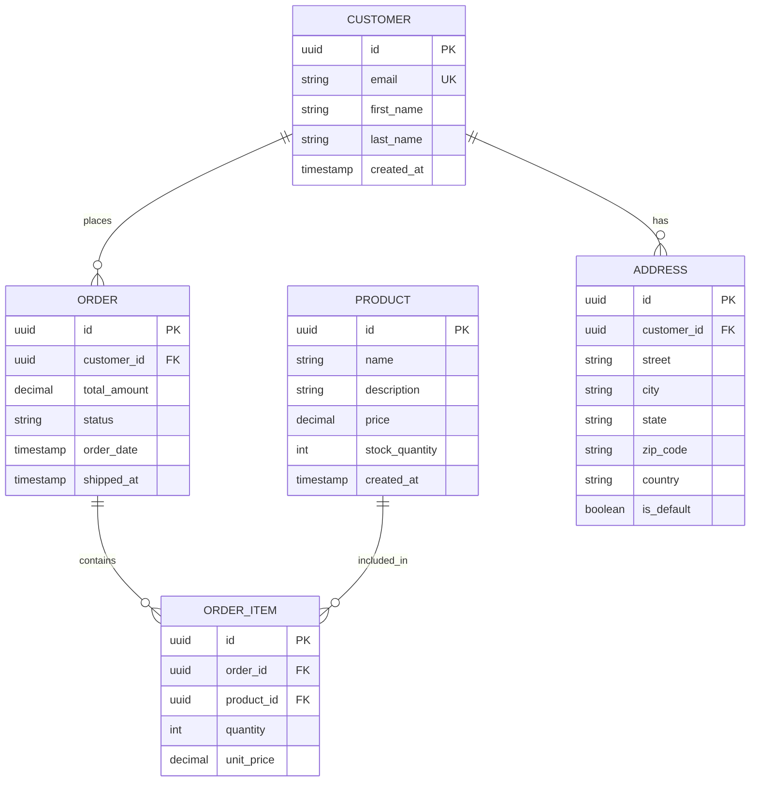

---

## User Journey Diagrams

### Online Shopping Experience

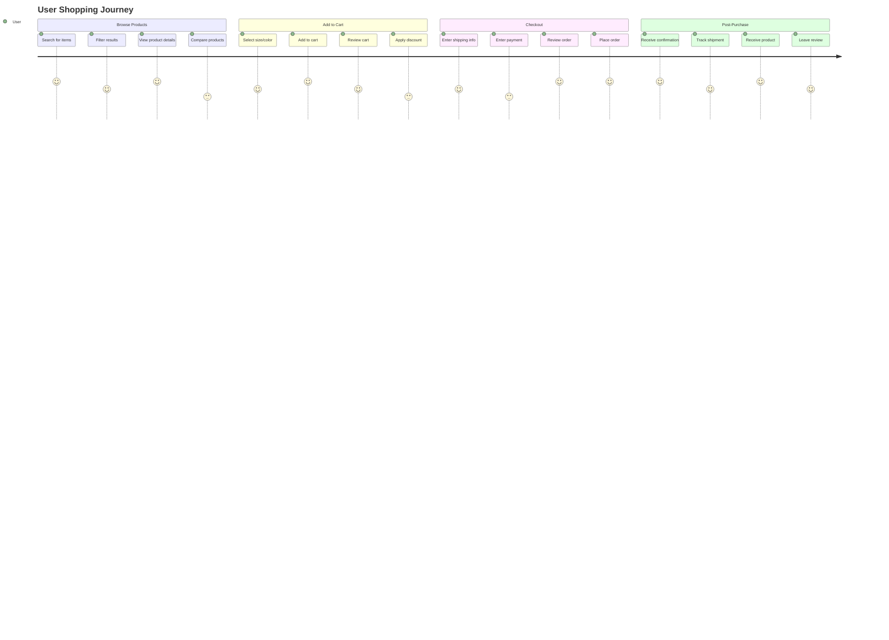

---

## Git Graphs

### Feature Development Flow

```mermaid
gitgraph
    commit id: "main"
    branch feature/login
    checkout feature/login
    commit id: "Add login form"
    commit id: "Add authentication"
    commit id: "Add validation"
    
    checkout main
    merge feature/login
    commit id: "Release v1.0"
    
    branch feature/search
    checkout feature/search
    commit id: "Add search API"
    commit id: "Add search UI"
    
    checkout main
    merge feature/search
    commit id: "Release v1.1"
```

---

## Gantt Charts

### Project Timeline

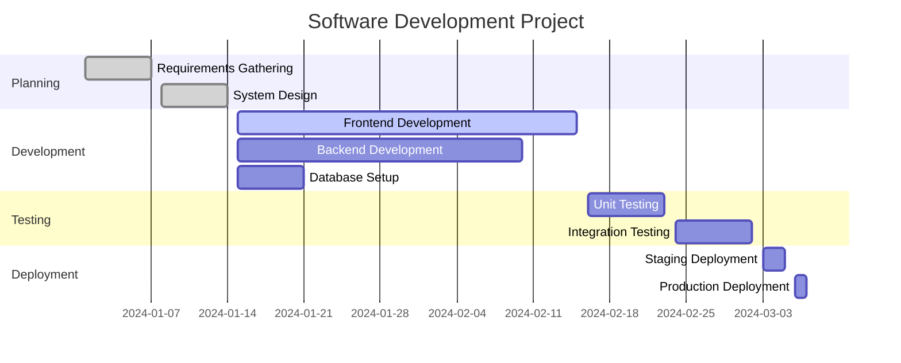

---

## Pie Charts

### Technology Stack Distribution

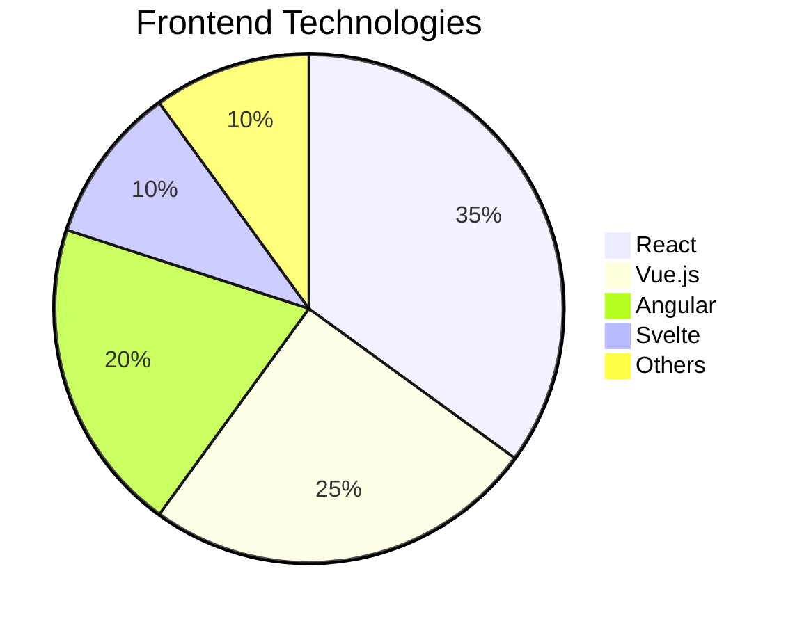

### Market Share Analysis

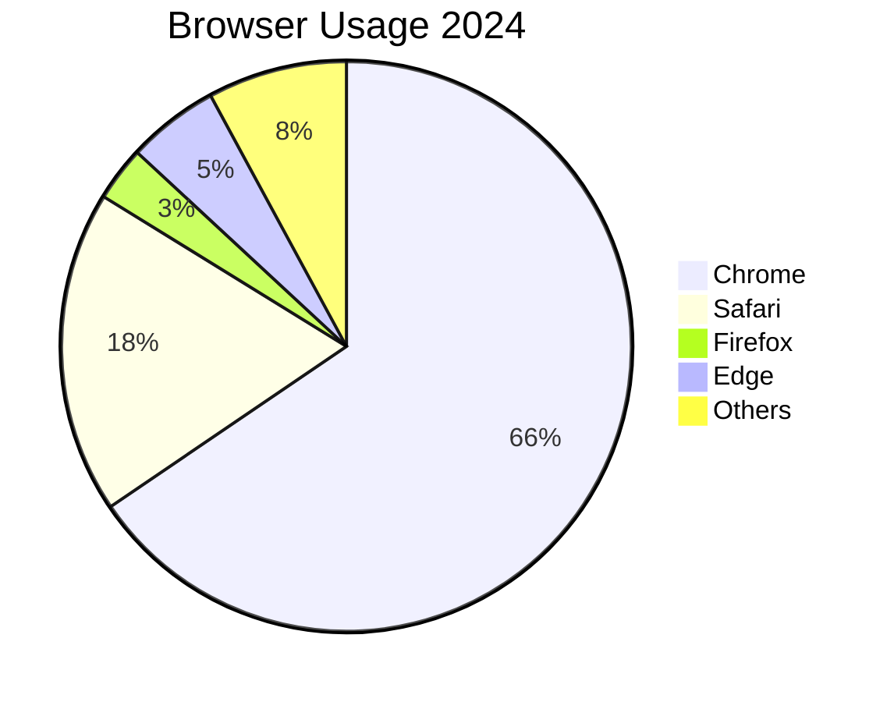

---

## Advanced Examples

### System Architecture with Styling

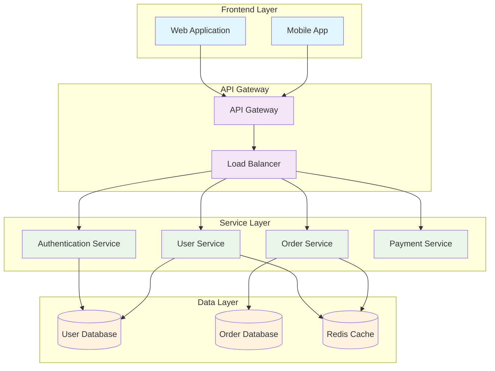

### Complex Sequence with Notes

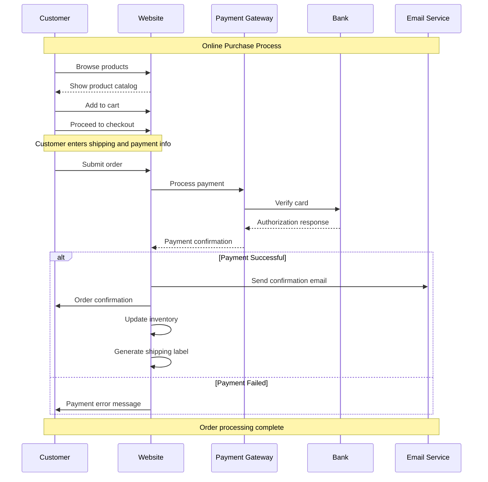

---

## Customization and Styling

### Custom Theme Configuration

```typescript
// slidev.config.ts
import { defineConfig } from '@slidev/types'

export default defineConfig({
  mermaid: {
    theme: 'default',
    themeVariables: {
      primaryColor: '#3b82f6',
      primaryTextColor: '#1f2937',
      primaryBorderColor: '#2563eb',
      lineColor: '#6b7280',
      secondaryColor: '#f3f4f6',
      tertiaryColor: '#f9fafb',
      background: '#ffffff',
      mainBkg: '#f9fafb',
      secondBkg: '#f3f4f6',
      tertiaryBkg: '#e5e7eb'
    },
    flowchart: {
      curve: 'basis',
      padding: 20
    },
    sequence: {
      actorMargin: 50,
      width: 150,
      height: 65
    }
  }
})
```

### CSS Styling

```css
/* Custom Mermaid styles */
.mermaid {
  font-family: 'Inter', sans-serif;
}

.mermaid .node rect {
  fill: #3b82f6;
  stroke: #2563eb;
  stroke-width: 2px;
}

.mermaid .node.classBox rect {
  fill: #10b981;
  stroke: #059669;
}

.mermaid .edgePath path {
  stroke: #6b7280;
  stroke-width: 2px;
}
```

---

## Integration Tips

### With Other Modules

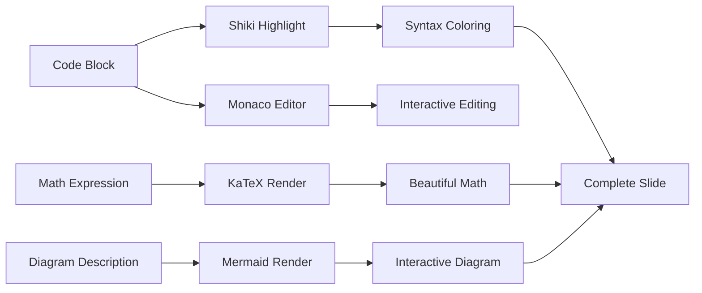

### Performance Considerations

1. **Limit diagram complexity** - Complex diagrams can slow down rendering
2. **Use appropriate themes** - Dark themes work better for presentations
3. **Optimize for mobile** - Consider responsive design for diagrams
4. **Lazy loading** - Load diagrams only when needed

---

## Troubleshooting

### Common Issues

#### Diagrams Not Rendering
1. Check Mermaid is enabled in slidev.config.ts
2. Verify proper code block syntax: ` ```mermaid`
3. Ensure valid Mermaid syntax

#### Styling Issues
1. Check theme configuration in config file
2. Verify CSS class names are correct
3. Test with different themes

#### Performance Problems
1. Simplify complex diagrams
2. Use appropriate diagram types
3. Consider breaking large diagrams into smaller ones

### Browser Compatibility

- ✅ **Chrome** 80+
- ✅ **Firefox** 75+
- ✅ **Safari** 13+
- ✅ **Edge** 80+

---

*Mermaid brings professional diagram creation to your presentations with simple, readable syntax!*